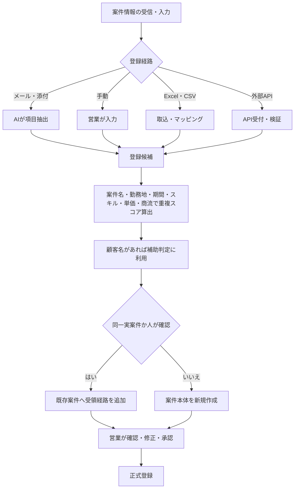
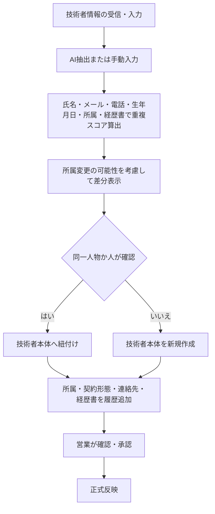
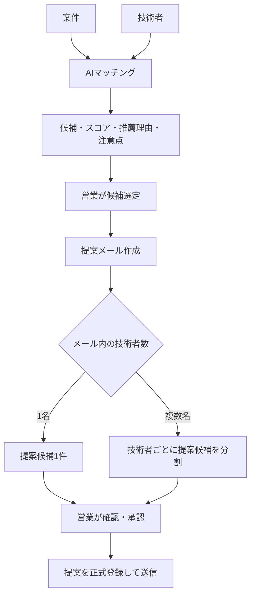
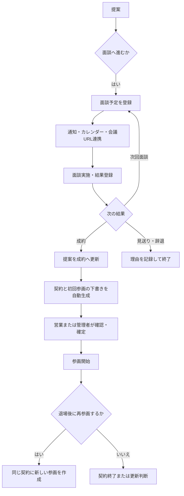
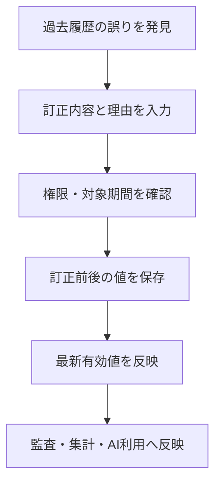

# 03_業務フロー

SESN (System Engineer Sales Navigator)

> 本書は要件定義を業務処理へ展開したTo-Be業務フローである。GitHub上の本ファイルを正本とする。

---

## 1. 基本原則

- 案件の登録経路は、メール・添付からのAI抽出、営業による手動登録、Excel・CSV取込、外部API登録とする。
- AI抽出データは現時点では自動確定せず、営業担当者の確認・修正・承認後に正式登録する。
- 将来は、十分な精度・監査・取消機構を整備した後、高確信度データの自動登録へ段階的に移行する。
- 1つの実案件を複数のBPから受領した場合、案件本体を共通化し、受領元・条件・商流は案件受領経路として分離管理する。
- 同一人物の技術者本体は1件とし、所属会社、契約形態、連絡先、経歴書等は履歴管理する。
- 会社は1件の会社本体にBP、顧客、所属会社等の複数役割を付与する。
- 提案の基本単位は「1案件 × 1技術者 × 1提案先BP担当者」とする。
- 内部IDはUUID、利用者向けには短い管理番号を使用する。
- 過去履歴の誤りは訂正履歴を残して修正する。

---

## 2. 案件登録フロー

### 2.1 案件受領経路

案件本体とは別に、次を受領元単位で保持する。

- BP会社・BP担当者
- 受領日時
- 受領メール・添付
- 提示単価・精算条件
- 商流
- 元請・エンド顧客情報
- 独自条件・注意事項
- 有効／無効状態

### 2.2 案件重複判定

- 顧客名は未記載の場合が多いため、必須条件にしない。
- 案件名、勤務地、期間、必須スキル、単価、商流等の組合せで候補スコアを算出する。
- 顧客名がある場合は補助要素として加点する。
- システムは候補と根拠を表示し、自動統合は行わない。

---

## 3. 技術者登録・更新フロー

### 3.1 技術者重複判定

- 所属会社は転職・所属変更があるため、単独で同一人物を否定しない。
- 判定スコア、差分、根拠を表示し、自動統合は行わない。
- 既存技術者への統合を選択した場合も、所属履歴等は上書きせず追加する。

---

## 4. マッチング・提案フロー

### 4.1 提案の識別単位

- 1提案 = 1案件 × 1技術者 × 1提案先BP担当者。
- 同一技術者を複数担当者へ送る場合は、それぞれ別提案とする。
- 同一担当者への再送・再提案は、前回提案を上書きせず新しい提案として登録する。
- 1通のメールで複数技術者を提案した場合、メールは1件、提案は技術者数分作成する。
- 各提案は、使用した経歴書バージョンを保持する。

### 4.2 AI分析対象

- 初回提案／再提案
- AI生成文、営業編集文、実送信文
- 使用経歴書バージョン
- 提案日・曜日・時刻
- 案件、技術者、BP会社、BP担当者
- 提案結果、面談化、成約、見送り・辞退理由

---

## 5. 面談・成約・参画フロー

### 5.1 契約と参画

- 1件の契約に複数の参画期間を持たせる。
- 一時退場後の再参画は、新しい参画レコードとして登録する。
- 過去の参画期間は再開・上書きしない。
- 期間が重複する場合は初期実装では警告し、確定可否は権限・業務ルールで制御する。

### 5.2 将来自動化

現時点では契約・参画情報の下書き生成までを自動化する。将来は、入力精度、整合性検証、権限、監査、取消・再実行方式を確立した後、条件を満たす案件に限って自動確定を可能とする。

---

## 6. 履歴訂正フロー

- 訂正前値、訂正後値、理由、実行者、日時を保存する。
- 無痕跡の直接上書きは行わない。
- 集計・AI分析では最新の有効訂正値を使用する。

---

## 7. 例外フロー

- AI抽出の確信度が低い場合：人の確認へ戻す。
- 重複候補が複数ある場合：差分とスコア根拠を表示し、営業が統合先を選択する。
- 契約注意BP：提案候補から除外せず、警告表示と理由確認を行う。
- 外部カレンダー削除：業務履歴を削除せず、外部削除済み状態で保持する。
- メール送信失敗：提案は送信失敗状態とし、再送履歴を別途保持する。
- 完全削除：正当な理由、管理者権限、事前確認、監査ログを必須とする。

---

## 8. 今後の詳細設計事項

- 共通スキルマスタと案件・技術者スキルの管理方式
- 共通タグの適用対象
- 添付ファイル・コメントの共通管理方式
- 通知のチャネル共通管理方式
- AI実行履歴の共通管理方式
- AI自動登録へ移行する確信度・監査条件
- 契約自動確定へ移行する条件
- メールと複数提案の送信・取消・再送整合性
- 再提案の分析上の扱い

---

## 更新履歴

|日付|内容|
|----|----|
|2026-07-25|案件登録、技術者統合、提案、面談、成約のTo-Be業務フロー初版を作成|
|2026-07-26|会社複数ロール、技術者・案件の重複スコア判定、契約1対複数参画、履歴訂正フローを追加|