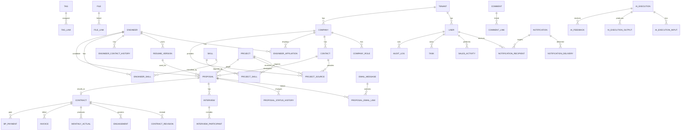

# 04_DB設計

SESN (System Engineer Sales Navigator)

> 本書は中核エンティティ、所有関係、履歴境界を定義する論理DB設計である。物理カラムは `docs/08_テーブル設計.md` で詳細化する。

---

## 1. 設計原則

- 案件、技術者、会社、担当者、提案、面談、契約、参画を独立エンティティとして管理する。
- 業務上の変更履歴は上書きせず、履歴テーブルまたは訂正履歴へ保存する。
- 通常削除は論理削除とし、完全削除は例外運用とする。
- AIの抽出候補、判断理由、人による承認・修正結果を追跡可能にする。
- テナント分離を前提とし、主要テーブルに `tenant_id` を持たせる。
- 内部主キーはUUIDを採用し、人が扱う画面・帳票・問い合わせ用に短い管理番号を別途付与する。
- 日時は原則UTC保存、画面表示時に利用者タイムゾーンへ変換する。
- スキル、タグ、ファイル、コメント、通知、AI実行履歴は対象横断の共通エンティティとして設計する。

---

## 2. 中核ER図

---

## 3. エンティティ一覧

### 3.1 組織・利用者

|エンティティ|役割|
|---|---|
|TENANT|利用会社・テナント|
|USER|システム利用者|
|ROLE / PERMISSION|ロール・権限|
|USER_DATA_SCOPE|担当範囲、項目権限、AI参照範囲|
|IP_ALLOWLIST|会社・ユーザー単位の許可IP|

### 3.2 会社・担当者・技術者

|エンティティ|役割|
|---|---|
|COMPANY|会社本体。BP、顧客、所属会社等を兼用可能|
|COMPANY_ROLE|会社に付与する複数役割。BP、顧客、所属会社、エンド顧客等|
|CONTACT|会社に所属する担当者|
|ENGINEER|同一人物としての技術者本体|
|ENGINEER_AFFILIATION|所属会社・契約形態の履歴|
|ENGINEER_CONTACT_HISTORY|メール、電話、住所等の履歴|
|ENGINEER_PREFERENCE_HISTORY|希望単価、勤務地、稼働条件の履歴|
|RESUME_VERSION|経歴書の版管理|
|CERTIFICATION|資格履歴|

会社は役割ごとに重複登録せず、1件の `COMPANY` に複数の `COMPANY_ROLE` を付与する。

### 3.3 スキル

|エンティティ|役割|
|---|---|
|SKILL|技術者・案件で共通利用するスキルマスタ|
|ENGINEER_SKILL|経験年数、習熟度、最終利用日、自己・営業評価|
|PROJECT_SKILL|必須／尚可、要求レベル、経験年数等の案件要求|

同一の `SKILL` を技術者側と案件側で共有し、名称揺れ・別名・カテゴリはマスタ側で管理する。

### 3.4 案件

|エンティティ|役割|
|---|---|
|PROJECT|同一実案件の共通本体|
|PROJECT_SOURCE|BPごとの受領経路・条件・商流|
|PROJECT_SKILL|必須・尚可スキル|
|PROJECT_STATUS_HISTORY|案件状態履歴|
|PROJECT_DUPLICATE_CANDIDATE|重複候補、判定スコア、根拠、確認結果|

`PROJECT_SOURCE` に受領メール、BP会社・担当者、提示条件、商流を保持し、複数BPから受領した同一案件を統合可能にする。

### 3.5 提案

|エンティティ|役割|
|---|---|
|PROPOSAL|1案件 × 1技術者 × 1提案先担当者|
|PROPOSAL_STATUS_HISTORY|提案状態の変更履歴|
|PROPOSAL_REASON|見送り・辞退理由|
|PROPOSAL_EMAIL_LINK|メールと複数提案の中間テーブル|
|PROPOSAL_ANALYTICS_CONTEXT|初回・再提案、曜日、時刻等の分析用スナップショット|

`PROPOSAL` は同じ組み合わせの再提案を許可する。再提案時は既存行を更新せず、新しい行を作成し、必要に応じて `previous_proposal_id` で前回提案へ連結する。

### 3.6 メール

|エンティティ|役割|
|---|---|
|MAIL_ACCOUNT|主アカウント・共有メールボックス|
|EMAIL_THREAD|外部メールスレッド|
|EMAIL_MESSAGE|受信・送信メール|
|PROPOSAL_EMAIL_LINK|1通のメールと複数提案の関連|

メール添付は専用ファイル本体を重複保持せず、共通 `FILE` と `FILE_LINK` を利用する。

### 3.7 面談・契約・参画

|エンティティ|役割|
|---|---|
|INTERVIEW|提案に紐づく面談回|
|INTERVIEW_PARTICIPANT|技術者、BP、顧客、営業、その他参加者|
|INTERVIEW_EVALUATION|面談評価|
|CONTRACT|成約後の契約本体|
|CONTRACT_REVISION|更新・単価・条件変更履歴|
|ENGAGEMENT|参画期間・稼働状態。1契約に複数件を許可|
|ENGAGEMENT_EVALUATION|参画後評価|

1件の `CONTRACT` に複数の `ENGAGEMENT` を持たせ、一時退場、再参画、複数期間を表現する。契約条件の変更は `CONTRACT_REVISION`、実際の参画期間は `ENGAGEMENT` で管理する。

### 3.8 売上・請求・支払

|エンティティ|役割|
|---|---|
|MONTHLY_ACTUAL|月次稼働、売上、原価、粗利|
|INVOICE|請求・入金|
|BP_PAYMENT|BP・フリーランス支払|
|PRICE_HISTORY|請求・支払単価の履歴|

### 3.9 共通タグ

|エンティティ|役割|
|---|---|
|TAG|全業務対象で共通利用するタグマスタ|
|TAG_LINK|タグと技術者、案件、会社、担当者、提案等の関連|

`TAG_LINK` は `target_type` と `target_id` を持つ汎用関連とし、対象種別ごとの付与可否はアプリケーションルールで制御する。

### 3.10 共通ファイル

|エンティティ|役割|
|---|---|
|FILE|保存先、ファイル名、MIME、サイズ、ハッシュ、ウイルス検査状態等の本体情報|
|FILE_LINK|メール、技術者、案件、提案、面談、契約等との関連|

同一ファイルの重複保存抑止、アクセス権、保存期限、監査を一元管理する。実体はオブジェクトストレージへ保存し、DBにはメタデータと保存キーを保持する。

### 3.11 共通コメント

|エンティティ|役割|
|---|---|
|COMMENT|営業メモ、社内メモ、AIメモ等のコメント本体|
|COMMENT_LINK|コメントと対象業務データの関連|

コメント種別、公開範囲、作成者、AI生成有無、編集履歴を保持する。機密コメントは権限により表示制御する。

### 3.12 通知

|エンティティ|役割|
|---|---|
|NOTIFICATION|通知内容、種別、重要度、関連対象、発生日時|
|NOTIFICATION_RECIPIENT|ユーザー単位の宛先、既読・確認状態|
|NOTIFICATION_DELIVERY|メール、アプリ内、Teams、Slackごとの送信状態・再送履歴|

1つの通知イベントを複数チャネルへ配信できるよう、通知内容と配信試行を分離する。

### 3.13 AI・承認・監査

|エンティティ|役割|
|---|---|
|AI_EXECUTION|抽出、生成、推薦、要約、マッチング等の共通実行親|
|AI_EXECUTION_INPUT|参照対象、入力値、プロンプト版、モデル設定|
|AI_EXECUTION_OUTPUT|構造化結果、生成文、スコア、根拠、注意点|
|AI_APPROVAL|承認、修正、却下の履歴|
|AI_FEEDBACK|採用・却下・実績結果のフィードバック|
|AUDIT_LOG|主要操作、表示解除、出力、完全削除|
|CORRECTION_HISTORY|履歴データの訂正前後、理由、実行者、日時|

機能別の詳細データは子テーブルまたはJSON構造で保持するが、実行ID、テナント、利用者、モデル、処理時間、コスト、結果、エラーは `AI_EXECUTION` で一元追跡する。

---

## 4. 主要制約

### 4.1 提案制約

- `project_id`、`engineer_id`、`destination_contact_id` は必須。
- `resume_version_id` は送信確定時に必須。
- 再提案を許可するため、3項目だけの一意制約は設けない。
- 送信メールが複数提案を含むため、メールIDを `PROPOSAL` の単一外部キーにはせず中間テーブルを使う。

### 4.2 技術者同一性

- `ENGINEER` は人物本体。
- 所属、契約形態、連絡先、経歴書を別履歴へ分離する。
- 重複候補判定は氏名、メール、電話、生年月日、所属会社、経歴書内容等を組み合わせたスコア方式とする。
- 所属会社は転職・所属変更があり得るため、単独の一致・不一致で確定しない。
- 自動統合は行わず、候補、差分、判定根拠を表示して人が決定する。

### 4.3 案件同一性

- 重複判定は案件名、勤務地、期間、必須スキル、単価、商流等を組み合わせる。
- 顧客名は未入力でも判定可能とし、取得できた場合のみ補助判定に利用する。
- 自動統合は行わず、人が新規登録または既存案件への統合を決定する。

### 4.4 契約と参画

- `CONTRACT` 1件に対して `ENGAGEMENT` を0件以上保持できる。
- 再参画時は過去の `ENGAGEMENT` を再開せず、新しい `ENGAGEMENT` を作成する。
- 期間重複は初期実装で警告し、確定時に理由入力を要求できるようにする。

### 4.5 ID方針

- 内部主キーはUUIDとする。
- 画面、帳票、問い合わせでは短い管理番号を利用する。
- 管理番号はテナント内で一意とし、エンティティ種別ごとの接頭辞を付与可能とする。
- 外部APIではUUIDを基本とし、必要に応じて管理番号検索も提供する。

### 4.6 履歴訂正

- 過去履歴の誤りは元データを無痕跡で上書きしない。
- 訂正前値、訂正後値、訂正理由、実行者、実行日時を保存する。
- 集計・AI分析では、原則として最新の有効訂正値を利用する。

### 4.7 共通エンティティ関連

- `TAG_LINK`、`FILE_LINK`、`COMMENT_LINK` は対象種別と対象IDを保持する。
- 対象削除時も監査上必要な関連は即時物理削除せず、論理削除または孤立防止処理を行う。
- 共通関連先の存在確認はサービス層で必須とし、不正な対象種別・IDを登録させない。
- ファイル、コメント、通知、AI実行履歴は対象データの閲覧権限を継承する。

### 4.8 論理削除

主要業務テーブルは次を共通保持する。

- `id`, `management_no`, `tenant_id`
- `created_at`, `created_by`
- `updated_at`, `updated_by`
- `deleted_at`, `deleted_by`
- `row_version`

完全削除は通常APIから分離し、専用権限・理由・承認・監査を必須とする。

---

## 5. AI自動化段階

|段階|案件登録|契約生成|
|---|---|---|
|現行方針|AI候補→営業確認→正式登録|下書き自動生成→人が確定|
|将来方針|高確信度のみ自動登録|条件一致時のみ自動確定|

将来自動化では、確信度だけでなく、対象項目、重複候補、権限、監査、取消可能性、過去の修正率を判定条件に含める。

---

## 6. 次の設計課題

- 提案ステータス遷移と取消・差戻し方式
- 面談結果と提案状態の自動連動範囲
- 契約・参画・月次実績の締め処理
- 請求・支払の確定後訂正方式
- テナント別暗号鍵と機密項目暗号化
- ファイル実体の保存先・保持期間・版管理
- 汎用関連テーブルの参照整合性実装方式

---

## 更新履歴

|日付|内容|
|----|----|
|2026-07-25|中核エンティティ、提案単位、案件受領経路、技術者履歴、メール中間関係、契約下書きの論理設計初版を作成|
|2026-07-26|会社複数ロール、契約1対複数参画、技術者・案件の重複判定、UUID＋管理番号、履歴訂正方式を確定|
|2026-07-26|共通スキル、タグ、ファイル、コメント、通知・配信、AI実行履歴のエンティティ方式を確定|