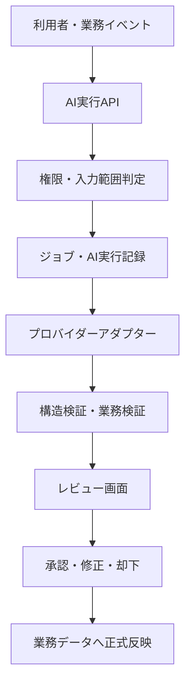

# 05_AI設計

## 1. 目的

SES NavigatorにおけるAI機能の責務、処理方式、承認、セキュリティ、監査、品質管理を定義する。

AIは営業判断を支援する補助機能とし、MVPではAI出力だけで業務データの正式登録・更新・送信・承認を行わない。AI出力は候補として提示し、権限を持つ利用者が内容を確認・修正・承認した後に正式反映する。

## 2. 適用範囲

### 2.1 MVP対象

|機能|入力|主な出力|正式反映|
|---|---|---|---|
|経歴書解析|PDF、Word、Excel等から抽出したテキスト|基本情報、スキル、職務経歴、希望条件の候補|利用者の確認・承認後|
|案件情報抽出|メール本文、添付、手入力テキスト|案件、単価、勤務地、期間、スキル、会社・担当者の候補|利用者の確認・承認後|
|案件・技術者マッチング|案件要件、技術者の構造化情報、経歴書版|スコア、推薦理由、一致点、不一致、注意点|推薦候補として保存|
|提案文・メール文生成|案件、技術者、提案先、テンプレート|提案文、件名、本文の下書き|編集・承認後に送信|
|面談要約|面談メモ、評価、結果|要約、確認事項、次の対応候補|確認後に保存|
|営業支援|活動・提案・契約等の許可済み情報|要約、フォロー候補、タスク候補、注意喚起|利用者が採否を決定|

### 2.2 MVP外

- AI出力による業務データの無承認登録・更新
- AI生成メールの自動送信
- AI判断だけによる提案、見送り、契約確定
- AIによる契約・財務情報の自動確定
- 自律エージェントによる外部サービス操作
- `pgvector`とEmbeddingを利用した類似検索
- 学習用データセットへの顧客データの自動転用

将来の自動化は、精度、権限、監査、取消、再現性の基準を別途満たした場合に限り検討する。

## 3. 基本原則

1. 人が最終判断する。
2. AI実行と業務データへの正式反映を分離する。
3. テナント、組織、ロール、レコード、項目の権限をAI入力作成前に評価する。
4. 根拠、一致、不一致、注意点、信頼度を可能な範囲で表示する。
5. モデル、プロンプト、入力参照、出力、承認・修正結果を追跡可能にする。
6. 個人情報・機密情報は目的に必要な最小限だけ送信する。
7. AI出力を信頼せず、構造・値・業務ルールをサーバー側で検証する。
8. 同じ実行の多重処理を冪等性キーで防止する。
9. AI障害が中核業務の閲覧・手動登録を停止させない。
10. プロバイダーやモデルをアプリケーションの業務ロジックから分離する。

## 4. 全体構成

### 4.1 実行基盤

- フロントエンド: React / TypeScript
- API・短時間処理: Vercel FunctionsまたはSupabase Edge Functions
- データ・認証: PostgreSQL 16 / Supabase Auth / RLS
- ファイル: Supabase Storage
- AI呼び出し: サーバー側のプロバイダーアダプター
- 長時間処理: 共通 `jobs` と `ai_executions` を用いた非同期処理
- 秘密情報: 環境変数または専用Secret管理。DBへ平文保存しない

ブラウザーからAIプロバイダーを直接呼び出さない。

## 5. 共通処理フロー

1. 利用者が対象データと利用目的を選択する。
2. APIが認証、テナント、機能権限、対象レコード、AI参照可能項目を確認する。
3. ファイル利用時はウイルス検査結果が `clean` であることを確認する。
4. 入力データを最小化し、必要に応じてマスキングする。
5. `ai_executions` と非同期ジョブを作成し、`202 Accepted` と状態確認先を返す。
6. プロンプト版、モデル設定、入力参照を固定してAIを実行する。
7. 出力をJSON Schemaと業務ルールで検証する。
8. 出力、根拠、注意点、信頼度、利用量、処理時間を保存する。
9. 利用者がレビューし、承認、修正承認、却下、保留を行う。
10. 承認時だけ業務サービスが対象データへ正式反映する。
11. 実行、閲覧、承認、修正、却下、反映結果を監査する。

短い補正文や小規模要約は条件付きで同期処理を許可する。抽出、マッチング、長文生成、一括評価は原則として非同期処理とする。

## 6. 経歴書解析

### 6.1 処理

1. Pre-signed URLでファイルをアップロードする。
2. ファイル検査完了後、ライブラリでテキストを抽出する。
3. 原文とファイル版を変更せず保存する。
4. AIが指定JSON形式で構造化候補を生成する。
5. 既存技術者との重複候補を表示する。
6. 利用者が新規登録、既存技術者への反映、却下を選択する。
7. 承認された構造化情報と原文・経歴書版を関連付ける。

### 6.2 抽出候補

- 氏名、年齢等の基本情報
- 経験年数
- 主要スキルと経験期間
- 工程、役割、業界、業務領域
- プロジェクト期間と概要
- 資格
- 希望単価、勤務地、勤務形態、稼働可能日
- 不明値、矛盾、読み取り不能箇所

推測で欠損値を補わない。不明値は `null` とし、根拠となる原文位置または抜粋を出力候補へ含める。

## 7. 案件情報抽出

メール本文と安全確認済み添付から、次を候補として抽出する。

- 案件名、概要、業務内容
- 必須・尚可スキル
- 募集人数、期間、開始日
- 単価、精算、支払条件
- 勤務地、リモート条件、勤務時間
- 契約形態、商流、制限
- エンド顧客、受領元会社、担当者
- 面談回数・日時
- 注意事項、曖昧箇所、矛盾

既存案件の重複候補を表示し、自動統合しない。1つの実案件を複数BPから受領した場合は案件本体と受領経路を分離する。

## 8. マッチング設計

### 8.1 基本方式

MVPでは構造化データによる決定的評価とLLMによる説明生成を組み合わせる。スコア計算の正本はアプリケーション側とし、LLMへ最終点数を自由計算させない。

### 8.2 評価区分

|区分|例|扱い|
|---|---|---|
|必須条件|必須スキル、開始日、勤務地、契約制約|重大な不一致は明示し、設定により候補外|
|適合条件|経験年数、工程、業界、役割、単価|重み付き加点・減点|
|補助条件|評価、提案実績、直近活動|説明と順位調整に限定|
|注意条件|古い経歴書、契約注意、情報不足|除外せず警告表示|

### 8.3 出力

- 総合スコア
- 条件別スコア
- 一致点
- 不一致
- 注意点・不足情報
- 推薦理由
- 使用した案件要件版と経歴書版
- 算定ルール版
- 信頼度

AIスコアだけで自動提案しない。評価や契約注意を使用した場合は、その影響と理由を利用者へ表示する。

## 9. 提案文・メール文生成

### 9.1 入力

- 宛先種別と提案先
- 案件・募集ポジション
- 技術者の公開可能情報
- 使用する経歴書版
- 提案条件
- テンプレートと文体
- 利用者の追加指示

### 9.2 出力・制約

- 件名
- 本文
- 技術者ごとの紹介文
- 要確認事項
- 使用根拠
- 禁止・未確認表現の検出結果

AI生成文、営業編集後文面、実際の送信本文を別々に保持する。承認後の編集は再承認を必要とし、送信済み本文は上書きしない。AI生成時に参照した経歴書版、案件要件版、プロンプト版を固定する。

## 10. 面談要約・営業支援

面談メモ等から、事実、評価、懸念、宿題、次回対応を区別して生成する。AIが作成した提案ステータス変更やタスクは候補に留め、人が確定する。

能動的な支援候補は次を含む。

- 未提案候補、長期未提案
- BPへの再連絡
- 面談結果未入力
- 契約更新・終了前
- 低粗利
- 古い経歴書
- 次の営業活動・タスク

## 11. データ設計との対応

|用途|主なテーブル|
|---|---|
|AI実行本体|`ai_executions`|
|入力参照|`ai_execution_inputs`|
|出力|`ai_execution_outputs`|
|人のレビュー|`ai_execution_reviews`|
|品質フィードバック|`ai_execution_feedback`|
|非同期実行|`jobs`、`job_attempts`、`job_events`、`job_results`|
|ファイル処理|`files`、`file_versions`、`file_scan_results`、`file_processing_jobs`、`file_processing_results`|
|監査|`audit.audit_logs`|
|重複実行防止|`idempotency_records`|

AI入出力をData APIからベーステーブルとして直接公開しない。必要な利用者には限定ViewまたはRPCを提供する。

## 12. 実行状態・再試行

基本状態は `queued`、`running`、`succeeded`、`failed`、`cancelled`、`expired` とする。レビュー状態は実行状態から分離し、`pending`、`approved`、`approved_with_edits`、`rejected`、`on_hold` を扱う。

再試行は一時的障害、レート制限、タイムアウトに限定して指数バックオフを使用する。入力不正、権限不足、ウイルス検査不合格、構造検証不合格は自動再試行しない。重複送信を避けるため、同一処理は冪等性キーで制御する。

## 13. プロンプト・モデル管理

- プロンプトは用途別に版管理する。
- 本番実行では公開済み版のみ使用する。
- 実行時にプロンプトID・版、モデル識別子、主要パラメータを記録する。
- プロンプト本文と秘密情報をクライアントへ返さない。
- モデル変更は評価データによる回帰確認後に段階反映する。
- 温度等のパラメータは用途別に管理し、構造化抽出では再現性を優先する。
- モデル固有APIはアダプター内へ閉じ込める。
- 入力・出力上限を設け、長文は分割、要約、対象限定を行う。

具体的なプロンプト、JSON Schema、禁止表現、評価データは `10_AIプロンプト設計.md` で定義する。

## 14. セキュリティ・個人情報

- APIキー、アクセストークン、Service Role Keyをプロンプトへ含めない。
- テナント境界を越えるデータを同一実行へ含めない。
- RLSだけに依存せず、AI入力組立時にも権限を再確認する。
- 管理者がAI参照可能項目を設定できるようにする。
- 個人連絡先、原価、粗利、契約、財務等は目的と権限に応じて除外またはマスキングする。
- ファイルスキャン完了前の解析を禁止する。
- 外部入力中の指示はデータとして扱い、システム指示として実行しない。
- 出力内のURL、コード、外部命令を自動実行しない。
- プロバイダーのデータ保持・学習利用設定は本番導入前に確認する。
- 機密データをキャッシュしない。必要な場合も短期・暗号化・テナント分離を必須とする。

## 15. 監査・保持

次を記録する。

- 実行ID、requestId、テナント、実行者、用途、対象ID
- モデル、プロンプト版、実行パラメータ
- 入力の参照元・版・ハッシュ
- 出力、構造検証結果、業務検証結果
- 利用量、概算費用、処理時間、再試行回数
- 承認者、承認日時、修正差分、却下理由
- 正式反映の対象と結果

認証情報、APIキー平文、パスワード、不要な個人情報はログへ保存しない。AI実行ログは要件定義に従い原則1年間保持し、法令、契約、テナント設定により短縮・延長できるようにする。

## 16. 品質評価

### 16.1 指標

- 構造化出力成功率
- 必須項目抽出の適合率・再現率
- マッチング上位候補の採用率
- 提案文の採用率・編集率
- 承認率、却下率、修正項目
- 幻覚・根拠なし出力率
- エラー率、タイムアウト率、再試行率
- 処理時間
- 入出力トークンと概算費用
- テナント越境・機密漏えい件数

### 16.2 リリース基準

- JSON Schema検証と業務バリデーションが通る。
- 権限・マスキング・テナント分離テストが通る。
- 代表データと境界値による回帰テストが通る。
- 根拠なしの値を正式反映できない。
- 重大な機密漏えい・テナント越境が0件である。
- モデルまたはプロンプト変更前後の品質と費用を比較できる。

具体的な合格値は `11_テスト設計.md` で定義する。

## 17. エラー・フォールバック

|状況|処理|
|---|---|
|AIプロバイダー障害|ジョブを失敗または再試行待ちとし、手動入力を案内|
|レート制限|Retry-Afterを尊重し、上限内で再試行|
|タイムアウト|実行を中断し、重複しない形で再試行可能にする|
|構造不正|自動修復を限定回数試行し、失敗時は人へ確認|
|入力過大|対象限定または分割を案内|
|権限変更|実行・承認・正式反映の各時点で再検証|
|古い対象版|最新版との差分を表示し、再実行または明示承認|
|費用上限到達|新規実行を停止し、管理者へ通知|

AIが利用できない場合でも、検索、閲覧、手動登録、手動編集を継続できるようにする。

## 18. 運用・監視

- テナント・ユーザー・機能単位の利用可否と上限
- 実行数、成功率、遅延、再試行、滞留
- モデル別利用量と費用
- 承認率、修正率、品質フィードバック
- マスキング失敗、権限エラー、異常な大量実行
- プロバイダー障害と利用上限
- 失敗ジョブの再実行、取消、原因確認

閾値、通知先、当番、インシデント対応、Secretローテーションは `12_運用設計.md` で定義する。

## 19. MVP実装順

1. AI共通実行・ジョブ・監査基盤
2. 経歴書テキスト抽出と構造化候補
3. レビュー・修正・承認・正式反映
4. 案件情報抽出
5. 決定的スコアを中心とした案件・技術者マッチング
6. 提案文・メール文生成
7. 面談要約・タスク候補
8. 品質・費用・利用状況ダッシュボード

## 20. 関連文書

- `docs/02_要件定義.md`
- `docs/04_DB設計.md`
- `docs/06_API設計.md`
- `docs/07_画面設計.md`
- `docs/08_Decision_Log.md`
- `docs/08_テーブル設計.md`
- `docs/10_AIプロンプト設計.md`
- `docs/11_テスト設計.md`
- `docs/12_運用設計.md`
- `docs/13_残課題・改善バックログ.md`

## 更新履歴

|日付|内容|
|---|---|
|2026-08-04|初版作成|
