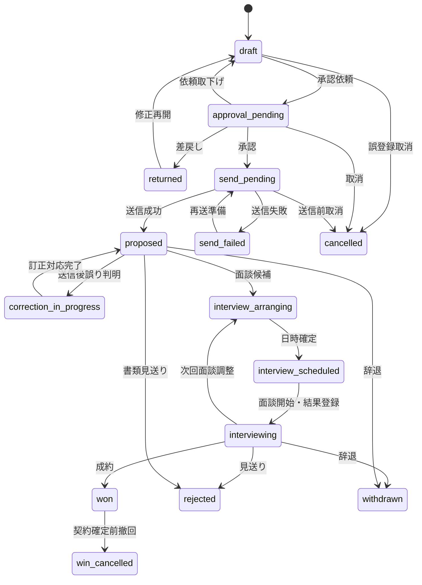

# 05_状態遷移設計

SESN (System Engineer Sales Navigator)

> 本書は提案・面談・契約・参画に関する状態、遷移条件、承認、訂正および監査方式を定義する。GitHub上の本ファイルを正本とする。

---

## 1. 設計原則

- 状態は業務上の事実を表し、過去の事実を無痕跡に書き換えない。
- 状態変更は遷移ルール、権限、必須入力、監査記録を通して実行する。
- AI・外部連携・システムによる自動変更も、人による変更と同じ状態履歴へ記録する。
- 見送り、辞退、取消等から商談が実質的に復活した場合、元提案を再開せず新しい再提案を作成する。
- 入力ミスの訂正と、業務上の再開を区別する。
- 状態変更に伴うメール送信、通知、承認、契約下書き生成等は単一トランザクションまたは補償可能なワークフローとして扱う。

---

## 2. 提案状態

### 2.1 状態一覧

|状態コード|表示名|区分|説明|
|---|---|---|---|
|draft|下書き|進行中|提案内容・宛先・経歴書等を編集中|
|approval_pending|承認待ち|進行中|承認依頼済み|
|returned|差戻し|進行中|承認者が修正を要求|
|send_pending|送信待ち|進行中|承認済みで手動または予約送信待ち|
|send_failed|送信失敗|例外|メール送信処理が失敗|
|proposed|提案中|進行中|提案メール送信成功|
|correction_in_progress|送信済み・訂正対応中|例外|送信後の誤りに対し訂正対応中|
|interview_arranging|面談調整中|進行中|面談候補日時等を調整中|
|interview_scheduled|面談予定|進行中|面談日時確定|
|interviewing|面談進行中|進行中|複数回面談を含め面談プロセス中|
|won|成約|終了候補|成約登録済み。契約・参画下書きを生成|
|win_cancelled|成約取消|終了|契約確定前に成約が撤回|
|rejected|見送り|終了|提案先または選考側判断で終了|
|withdrawn|辞退|終了|技術者側または自社判断で終了|
|cancelled|取消|終了|誤登録等により提案自体を取り消し|

### 2.2 基本遷移

### 2.3 送信前状態の分離

提案送信前は、次を独立状態として管理する。

1. 下書き
2. 承認待ち
3. 差戻し
4. 送信待ち
5. 送信失敗

承認後に提案本文、宛先、添付、経歴書版、案件条件等を編集した場合、変更内容の軽重にかかわらず承認を失効させ、再承認を必須とする。

### 2.4 送信失敗

- メール送信失敗は専用の `send_failed` 状態とする。
- 1通のメールに複数提案が紐づく場合、メール送信が失敗した時点で関連する全提案を送信失敗にする。
- 送信試行はメール・配信履歴として別レコードに保存する。
- 再送成功後に `proposed` へ遷移する。

### 2.5 送信後訂正

送信成功後に誤りが判明しても、外部へ送信した事実は取り消せないため `cancelled` へ変更しない。

- `correction_in_progress` へ遷移する。
- 訂正メール、電話、チャット等の対応履歴を保存する。
- 対応完了後は `proposed` またはその時点の実業務状態へ戻す。

---

## 3. 承認ワークフロー

### 3.1 承認要否

- 通常提案は担当営業自身で確定可能とする。
- 上長承認が必要となる条件は管理者がルールとして設定する。
- 例：低粗利、契約注意BP、高額条件、個人情報を含む送信、初回取引先、特定商流。
- MVPは原則1段階承認とする。
- データ構造は将来の複数段階承認に対応可能とする。

### 3.2 差戻し・取下げ

- 承認者の差戻し時は理由・コメントを必須とする。
- 担当営業は承認待ちの依頼を取り下げ、履歴を残して下書きへ戻せる。
- 再申請時は新しい承認試行として履歴を追加する。

### 3.3 期限超過

- 承認依頼には期限を設定できる。
- 期限接近・超過時にリマインドを送る。
- 上位者へのエスカレーション条件を設定可能とする。
- MVPではリマインドを実装し、エスカレーションは段階導入可能とする。

### 3.4 予約送信

- 承認済み提案は予約送信に対応する。
- 送信直前に宛先、添付、経歴書版、承認状態、削除・無効状態、送信禁止条件を再検証する。
- 検証失敗時は送信せず `send_failed` または再承認要求へ遷移し、理由を記録する。

---

## 4. 面談状態

### 4.1 状態一覧

|状態コード|表示名|説明|
|---|---|---|
|draft|下書き|面談候補情報の編集中|
|scheduling|日程調整中|候補日時を調整中|
|scheduled|予定|日時確定|
|completed|実施済み|面談実施済み|
|cancelled|キャンセル|面談中止|
|no_show|未実施|当日不参加等で未実施|

### 4.2 複数回面談

- 面談は回ごとに独立レコードを作成する。
- 提案は面談プロセス中に `interview_arranging`、`interview_scheduled`、`interviewing` を行き来できる。
- 面談回数、参加者、日時、結果、評価、次回要否を履歴として保持する。
- 過去面談を上書きして次回面談を表現しない。

### 4.3 面談結果と提案状態

- 面談結果から提案状態の更新候補をシステムが提示する。
- 通常は人が確認して反映する。
- 面談結果登録自体の上長承認は原則不要とする。
- 成約、重要条件変更等は管理者設定ルールにより確認・承認を要求できる。

### 4.4 面談キャンセル

- 面談予定は削除せず `cancelled` とする。
- キャンセル理由、実行者、日時、再調整要否を記録する。
- 再調整する場合は新しい面談レコードを作成する。

---

## 5. 成約・契約・参画

### 5.1 成約時

- 提案を `won` にすると、契約および初回参画の下書きを自動生成する。
- 自動生成後、人が内容を確認して確定する。

### 5.2 契約確定前の成約撤回

- 提案を `win_cancelled` とする。
- 契約・参画下書きは削除せず無効化する。
- 撤回理由、実行者、日時を保存する。

### 5.3 契約確定後の参画前キャンセル

- 提案の成約履歴は維持する。
- 契約は「開始前解約」とする。
- 参画は「開始前取消」とする。
- 契約・参画を削除し、提案を見送りへ戻す処理は禁止する。

---

## 6. 終了状態の訂正と再提案

### 6.1 入力ミスの訂正

- 担当営業も理由必須で訂正可能とする。
- 管理者は全件訂正可能とする。
- 訂正前後、理由、コメント、実行者、日時を保存する。
- 訂正済みの誤状態はKPI集計から除外し、監査履歴には残す。

### 6.2 業務上の復活

- 見送り・辞退後に商談が復活した場合、元提案は終了状態のまま保持する。
- 新しい提案を作成し、`previous_proposal_id` で元提案へ関連付ける。
- 新しい提案管理番号を発行する。
- 元提案と再提案は画面・分析で関連表示する。

### 6.3 終了前状態の誤操作

- 担当営業は理由を入力して直前状態へ訂正できる。
- 成約後や契約確定後は状態を巻き戻さず、専用の取消・解約状態を利用する。

---

## 7. 状態履歴

すべての状態変更について、次を保存する。

- 対象種別・対象ID
- 変更前状態
- 変更後状態
- 遷移イベント
- 理由コード
- 理由・コメント
- 実行主体種別：user / system / integration / ai
- 実行ユーザーまたはサービス主体
- 実行日時
- 変更元：画面、API、バッチ、外部連携
- 関連AI実行ID
- 関連承認依頼ID
- 訂正済みフラグおよび訂正元履歴ID
- KPI対象可否

状態履歴は通常の監査ログとは別に、業務履歴として検索・表示可能にする。

---

## 8. 権限

- 担当営業と管理者を基本の状態変更者とする。
- その他ユーザーはロール・権限設定により許可する。
- 上長承認、終了状態訂正、成約取消、開始前解約等は個別権限を設定可能とする。
- 対象データの閲覧権限がない利用者は状態履歴も閲覧できない。

---

## 9. データモデルへの要求

次のエンティティを設ける。

- `PROPOSAL_STATUS_HISTORY`
- `INTERVIEW_STATUS_HISTORY`
- `CONTRACT_STATUS_HISTORY`
- `ENGAGEMENT_STATUS_HISTORY`
- `APPROVAL_REQUEST`
- `APPROVAL_STEP`
- `APPROVAL_ACTION`
- `STATUS_TRANSITION_RULE`
- `APPROVAL_RULE`

状態マスタをDBで管理する場合も、許可遷移と副作用はアプリケーションサービスで必ず検証する。

---

## 10. APIへの要求

- 一般項目変更は `PATCH` を使用する。
- 業務状態変更は、汎用的な `status` 更新ではなく専用アクションAPIを使用する。
- 例：承認依頼、承認、差戻し、送信、取消、成約、成約取消。
- 楽観ロック用の `rowVersion` または `If-Match` を必須とする。
- 同一遷移の重複実行を防ぐため、重要操作ではIdempotency Keyを利用する。

---

## 更新履歴

|日付|内容|
|---|---|
|2026-07-26|提案・承認・送信・面談・成約・契約・参画の状態遷移、訂正、再提案、監査方式を確定|
